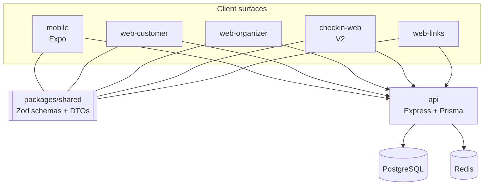

# MozCultura — Events Platform

Architecture showcase for a Mozambique-first events discovery and organizer
operations platform. The implementation is private; this repository documents
the system design and the decisions behind it.

**Status:** V1 (discovery) running in staging. V2 (transactional) built and
feature-flagged off. See [Product modes](docs/product-modes.md).

---

## What it is

A Turborepo/pnpm monorepo with six deployable surfaces sharing one API contract
package:

| Surface         | Stack                                   | Role                                     |
| --------------- | --------------------------------------- | ---------------------------------------- |
| `api`           | Express, TypeScript, Prisma, PostgreSQL | Single backend, port 8080                |
| `mobile`        | React Native, Expo 54, Expo Router      | Primary customer surface                 |
| `web-customer`  | Next.js 15, Mantine                     | Web discovery and event pages            |
| `web-organizer` | Next.js 15, Mantine                     | Organizer console                        |
| `checkin-web`   | Next.js 15                              | Venue door app (V2)                      |
| `web-links`     | Next.js 15                              | Universal/app-link bridge for deep links |

Shared packages: `shared` (Zod schemas and DTOs — the single source of truth for
API contracts), `i18n` (i18next, PT/EN), `design-tokens`.

Infrastructure: PostgreSQL, Redis, Docker Compose for local development plus two
staging variants (shared host infra, and fully self-contained). 24 Prisma
migrations to date.

---

## The three problems worth reading about

Most of this system is ordinary CRUD done carefully. Three parts required real
decisions, and each has its own document.

### 1. Shipping a transactional platform in non-transactional mode

Mobile money in Mozambique means M-Pesa and e-Mola, and organizers already
collect payment through those channels directly. Launching as a payment
processor before having any audience would have meant carrying payment
compliance and reconciliation risk to serve organizers who did not yet trust the
platform.

So V1 ships discovery only, while the orders, payments, tickets, wallet and
check-in code paths stay in the codebase, compiled, and switched off at build
time. V2 is a flag flip and a promotion of hidden routes back into navigation,
not a rewrite.

The hard part is not the flag. It is preventing eighteen months of drift in code
nobody exercises. → **[Product modes and the V1/V2 boundary](docs/product-modes.md)**

### 2. Check-in when the venue has no signal

Venues in Maputo lose connectivity, and a door that stops scanning is worse than
a door with no scanner at all. The design question is what a scanner should do
when it cannot reach the server and cannot know whether a ticket was already
used at the other gate.

The answer here is deliberately _not_ automatic conflict resolution. It is a
local queue with a six-state model that routes every disagreement to the
supervisor standing three metres away. → **[Offline check-in](docs/offline-checkin.md)**

**This is V2 code and has not run at a live event.** It is documented as a
design, not as a result.

### 3. One contract, six surfaces

Six clients against one API, two of them native, and no appetite for a
hand-maintained SDK. `packages/shared` holds Zod schemas that produce both the
runtime validators the API uses and the TypeScript types every client imports,
so a breaking change fails the build rather than reaching production.
→ **[Architecture](docs/architecture.md)**

---

## System shape

`packages/shared` is a compile-time dependency, not a network hop — every
surface imports the same schemas the API validates against.

---

## Engineering practice

- **Biome** for lint and format across the monorepo.
- **CI enforces documentation.** `repo-standards.yml` fails any pull request if
  the architecture guardrails, design doc, mobile guide, API guide or check-in
  spec are missing. Docs rot when nothing checks them.
- **Forward-only migrations**, 24 applied, each reviewed for table locks.
- **Self-conducted security review** — see the V1 review in the private
  repository; findings tracked as issues rather than a checklist.
- Feature flags resolve at build time via `NEXT_PUBLIC_*` inlining, which
  requires literal property access; dynamic lookups silently fail to inline.
  That constraint is documented at the call site because it is not obvious.

---

## Roadmap

Honest separation between what runs and what is designed.

|                                                              | Status                                                                  |
| ------------------------------------------------------------ | ----------------------------------------------------------------------- |
| Event discovery, organizer console, auth, follows, favorites | Running in staging                                                      |
| Orders, payments, tickets, wallet                            | Built, flagged off, not exercised                                       |
| Offline check-in queue and supervisor review                 | Built, flagged off, never used at a gate                                |
| Server-side scan idempotency                                 | Designed, not built — see [offline-checkin.md](docs/offline-checkin.md) |
| Cross-device conflict detection                              | Designed, not built                                                     |
| Payment provider integration (M-Pesa, e-Mola)                | Not started                                                             |

The gap between the third and fourth rows is the honest state of the offline
work: the client half exists, the server half that would make replay safe across
multiple gates does not.

---

## Documents

|                                             |                                                                                       |
| ------------------------------------------- | ------------------------------------------------------------------------------------- |
| [Architecture](docs/architecture.md)        | Monorepo layout, the shared contract package, backend structure, data and CI          |
| [Product modes](docs/product-modes.md)      | How a discovery-only V1 ships with the transactional V2 path compiled and flagged off |
| [Offline check-in](docs/offline-checkin.md) | The six-state sync queue, why conflicts go to a human, and what it does not do        |
| [Decisions](docs/decisions.md)              | Each choice with the alternative rejected and the cost accepted                       |

---

## Repository note

This repository contains architecture documentation only. The implementation
is private.
