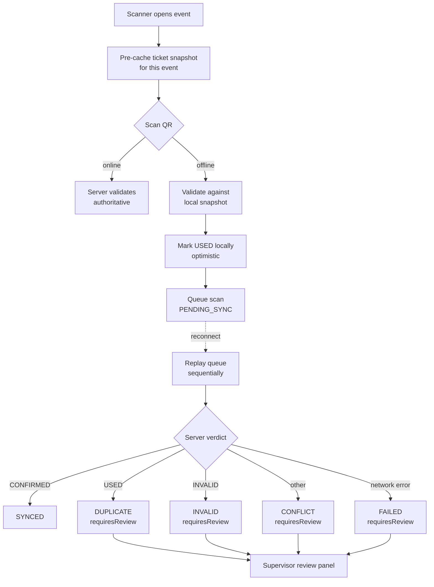

# Offline check-in

> **Status: V2. Built, feature-flagged off, never run at a live event.**
> This documents a design and its known holes, not a production result.

## The problem

A venue door scans tickets. Connectivity at Maputo venues is unreliable —
concrete, crowds, and a mobile network that degrades exactly when several
hundred people arrive at once. A scanner that stops working when the signal
drops is worse than no scanner, because the queue stops moving and the organizer
falls back to a printed list.

So the door must keep scanning offline. That creates the actual question:

> When a scanner cannot reach the server, it cannot know whether this ticket was
> already used at another gate two minutes ago. What should it do?

## Why not automatic reconciliation

The obvious answer is last-write-wins, or first-scan-by-server-receipt-time, or
vector clocks per device. All of them resolve conflicts automatically, and all of
them are wrong here.

A wrong automatic decision is silent. If the system decides a duplicate scan was
legitimate, a second person walks in on one ticket and nobody finds out until the
organizer reconciles revenue against headcount the next day. If it decides a
legitimate scan was a duplicate, a paying guest is turned away at the door with
no recourse.

The relevant fact about this problem domain is that **a human supervisor is
physically present**. Venue staff are standing at the gate. A flagged scan gets
human attention in seconds, and the human has information the system does not —
they can see the guest, look at the ID, and call it.

So the design goal is not to resolve conflicts. It is to **never resolve a
conflict silently**, and to make the flagged set small enough that a supervisor
can clear it.

## Design



### Pre-cached snapshot

On selecting an event the scanner downloads a snapshot of that event's tickets —
QR value, holder, ticket type, current status — and stores it locally with a
`cachedAt` timestamp. Offline validation runs against this snapshot, so an
offline scanner can still reject a QR code that was never sold, rather than
accepting everything and sorting it out later.

The snapshot is a point-in-time copy, which is precisely the source of the
duplicate problem below.

### Queue state model

```ts
type QueueSyncState =
  | "PENDING_SYNC"   // scanned offline, awaiting replay
  | "SYNCED"         // server confirmed, no disagreement
  | "DUPLICATE"      // server says already USED
  | "INVALID"        // server could not validate the QR
  | "CONFLICT"       // server returned some other non-CONFIRMED status
  | "FAILED";        // replay could not reach the server cleanly
```

Five of the six terminal states set `requiresReview: true`. Only `SYNCED` clears
without human attention. That ratio is intentional — the system's job is to
surface disagreement, not to absorb it.

`DUPLICATE` and `CONFLICT` are kept separate even though both mean "the server
disagreed", because they need different supervisor responses. `DUPLICATE` means
someone may be inside on this ticket already and the guest needs checking.
`CONFLICT` means the ticket was cancelled or refunded between snapshot and
replay, which is an organizer problem, not a door problem.

`FAILED` is distinguished from `INVALID` because a network error tells you
nothing about the ticket. Collapsing them would make a flaky connection look like
fraud.

### Replay

Replay triggers on the network coming back, and processes `PENDING_SYNC` entries
sequentially rather than in parallel. Sequential is slower and it is the right
choice: two scans of the same ticket replayed concurrently would race, and the
verdict on the second depends on the first having landed.

Each attempt increments `attemptCount` and records `lastAttemptAt`,
`lastServerStatus` and a human-readable `lastMessage`. The supervisor panel shows
attempt counts, because a scan that has failed four times is a different problem
from one that has failed once.

## What this does not do

Stated plainly, because the gap between this and a real distributed check-in
system is where the interesting remaining work is.

**No server-side idempotency.** `CheckInService.scan()` looks up the ticket,
checks status, marks it used. There is no scan ID, no device ID, no client
timestamp. A replayed scan is indistinguishable from a fresh one. If a scan
succeeds server-side but the response is lost, the retry comes back `USED` and
gets flagged `DUPLICATE` — a false positive that a supervisor has to clear
manually. The fix is a client-generated scan ID carried through to a unique
constraint, so a replay of an already-applied scan returns the original result
instead of a conflict.

**No offline timestamp.** The server records check-in time as the moment of
replay, not the moment of scan. After a thirty-minute outage the arrival curve is
wrong — every offline scan clusters at the reconnect. Reporting that depends on
arrival timing is not trustworthy across an outage.

**Single device, no cross-device awareness.** State lives in `localStorage`, so
each scanner sees only its own queue. Two gates scanning the same ticket while
both are offline will both admit, and both discover it at replay. Detecting this
before admission would require the gates to see each other, which at a venue
means local peer discovery or a small on-site relay — neither is built.

**Clock skew is unhandled** because client clocks are not trusted for ordering in
the first place. That is fine today only because ordering is not used; it stops
being fine the moment offline timestamps are recorded.

**No queue size bound.** Recent scans cap at 25 entries for display, but the
pending queue itself is unbounded. A long outage at a large event grows
`localStorage` without limit, and there is no eviction or overflow behaviour.

## What I would change first

In order, by ratio of risk removed to work required:

1. **Client-generated scan ID with a server unique constraint.** Removes the
   entire class of false `DUPLICATE` flags caused by lost responses, and it is a
   migration plus a few lines in the service.
2. **Carry `scannedAt` from the client, store it alongside server receipt time.**
   Keep both — the client one for arrival analytics, the server one for
   authority. Do not let the client one affect validation.
3. **Bound the queue** and define what happens when it fills.
4. **Cross-device conflict detection**, which is genuinely hard and probably not
   worth it until an organizer runs multiple gates at a scale where it bites.

Items 1 and 2 are what I would do before this ever runs at a real gate.
