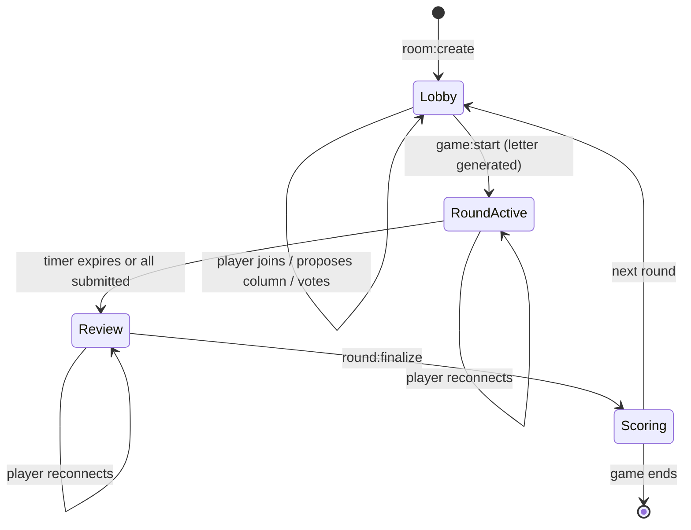

# Realtime model

## Authority

The server owns round phase, the timer, submissions and scoring. Clients render
state and send intents. There is no client-side prediction.

That is a deliberate cost. Prediction would make submission feel instant, and it
is rejected because the thing being predicted cannot be predicted: whether an
answer scores full, half or zero depends on what every other player wrote and on
votes that have not happened yet. A client that guesses will be wrong regularly,
and correcting a visible score downward is worse than a small delay on submit.

Where responsiveness matters — the moment of typing an answer — the client is
free to reflect local input immediately, because that is display, not scoring.

## Room lifecycle



Reconnection is not a separate state. A returning player is resolved against the
room's current phase and re-sent the state for that phase including their own
prior submissions, rather than being treated as a new join. Treating reconnect as
a distinct flow means writing recovery logic per phase; resolving into the
existing phase means one path.

## State ownership

| State | Home | Why |
|---|---|---|
| Room, players, round, submissions | Redis, via `RoomRepo` | Shared across instances; naturally expiring |
| Socket-to-player mapping | `socketRegistry` in process | Tied to the connection, dies with it |
| Match history, seasons, stats, profiles | PostgreSQL | Durable, queried outside gameplay |

The split is by lifetime. Anything whose life equals the room's belongs in Redis
with the room's TTL. Anything that outlives the room belongs in Postgres.
Anything that dies with the socket stays in process, because persisting it would
mean cleaning it up.

## Redis room store

`RedisRoomRepo` keys rooms by ID, maintains a separate code index so players can
join by short code, and holds a set of live room IDs. Multi-key updates — writing
the room and its code index together — go through `MULTI` so a crash cannot leave
a code pointing at a room that does not exist.

TTL is configured via `ROOM_TTL_SECONDS` and applied per room. Abandonment is the
normal end state for a casual lobby, and expiry handles it without needing to
distinguish "abandoned" from "everyone briefly disconnected" — which is precisely
the distinction that is hard to make correctly.

### The concurrency gap

Room mutation is read-modify-write:

```
findById(roomId) → mutate in memory → save(room)
```

There is no `WATCH` and no version field. Two backend instances processing
submissions for the same room concurrently can interleave, and the later write
wins wholesale — losing the earlier submission.

The window is small and, in practice, players in one room usually land on one
instance. It is still the correct thing to fix before scaling out, and the fix is
routine: add a `version` field, `WATCH` the key, and retry the transaction on
conflict. It is documented here rather than omitted because "Redis adapter for
horizontal scaling" is only half true without it — the transport scales, the
state does not yet.

## Transport

`@socket.io/redis-adapter` fans events out across instances via a pub/sub pair,
so a broadcast from any node reaches sockets connected to every other node.

Handlers are registered per lifecycle stage — `lobby`, `rooms`, `round`, `game`,
`disconnect` — and every one is wrapped by `wrapAck`, so a rejected or failed
intent returns `{ ok: false, error }` to the caller rather than disappearing.

Event contracts live in `@nome-terra/shared` as `ClientToServerEvents` and
`ServerToClientEvents`. Both the backend and the Next.js client import them, so
renaming an event breaks the build on both sides at once — which is the failure
mode you want, given the alternative is an emit that silently matches no handler.
